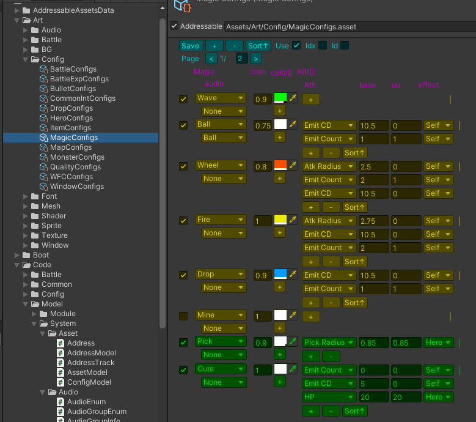
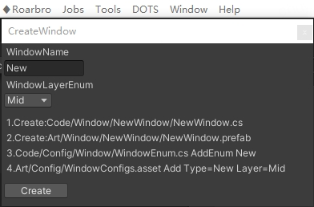
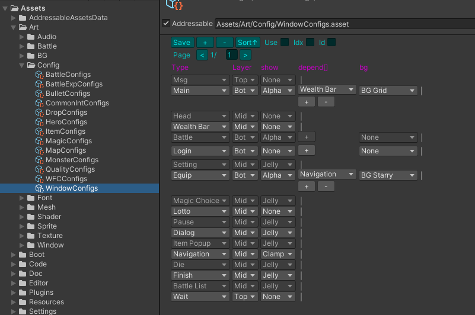
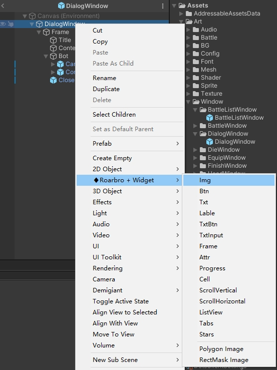

[TOC]

- [资源](#资源)
    - [配置](#配置)
- [对象池](#对象池)
- [界面](#界面)
    - [创建](#创建)
    - [配置](#配置-1)
    - [打开关闭](#打开关闭)
    - [弹幕](#弹幕)
    - [空气墙](#空气墙)
    - [对话框](#对话框)
    - [Loading](#loading)
    - [控件](#控件)
    - [列表](#列表)
    - [滚动列表](#滚动列表)
- [存储](#存储)
    - [本地存储](#本地存储)
- [事件](#事件)
    - [交互事件](#交互事件)
    - [框架事件](#框架事件)
- [时间](#时间)
    - [TimerModel](#timermodel)
    - [BattleTimeModel](#battletimemodel)
- [本地化](#本地化)
- [音频](#音频)
- [通讯](#通讯)
- [Model名词说明](#model名词说明)

# 资源
- Art文件夹 是资源根目录
- AssetModel类 提供加载接口
- Address类 定义资源地址(非必须)

### 配置

1. 在Project/Code/Config目录   
    右键♦Roarbro/Script/(..)Configs,  
    创建配置类(文件名不要带Configs，会自动补齐)  
2. 在Project/Art/Config目录   
    右键♦Roarbro/Configs/创建配置  

3. 获取：例：WindowConfigs.All，WindowConfigs.ConfigByID，WindowConfigs.ConfigByIndex

# 对象池
- 获取对象：SharedPool&lt;DialogInfo&gt;.Get();
- 缓存对象：SharedPool&lt;DialogInfo&gt;.Cache(info);

# 界面
### 创建

### 配置

### 打开关闭
- WindowModel.Open
- WindowModel.Close
- 关闭自己：CloseSelf

### 弹幕
- WindowModel.Msg(ColorUtil.ColorString(Color.red, "Account Error!"));

### 空气墙
-  AirModel.Add(transform, AirCallback, AirEnum);
-  AirModel.Remove(transform);

### 对话框
- WindowModel.Dialog("Are you okay?", OnConfirm, OnCancel);

### Loading
- WindowModel.Wait(true);
- WindowModel.Wait(false);

### 控件
WindowPrefab尽可能使用控件  

### 列表
以MagicChoiceList为例
1. 创建MagicChoiceCell和MagicChoiceList类，两者要Info一致
2. 在Hierarchy右键创建ListView控件
3. 替换控件里面的类为自己的

### 滚动列表
以MagicChoiceList为例
1. 创建LanguageCell和LanguageScroll类，两者要Info一致
2. 在Hierarchy右键创建Scroll控件
3. 替换控件里面的类为自己的

# 存储
### 本地存储
- LocalStoreModel

# 事件
### 交互事件
- ClickListener.Add(pauseBtn.transform).onClick += OnClick;
- DragListener.Add(pauseBtn.transform).onEventDrag += OnEventDrag;
### 框架事件
- EventModel：AddListener、RemoveListener、Send
- FrameMono集成了EventModel，提供接口：AutoListener、SendEvent

# 时间
### TimerModel
- TimerModel.Add(OnLogic, updateIntervalDic[BattleTimerEnum.Logic], true);
### BattleTimeModel
- BattleTimerModel.Add(OnLogic, BattleTimerEnum.Logic);

# 本地化
1. 配置: LanguageConfigs
2. 获得：LanguageModel.Instance.Get(configID)

# 音频
- AudioModel.PlaySound(AudioEnum.Click.StaticStr());

# 通讯
- HttpModel

# Model名词说明
Model类负责数据和管理
- 创建：♦Roarbro/Script/Singleton
- 存放位置:Assets/Code/Model
- Module是具体业务模块
- System是通用系统，可以通用其他项目